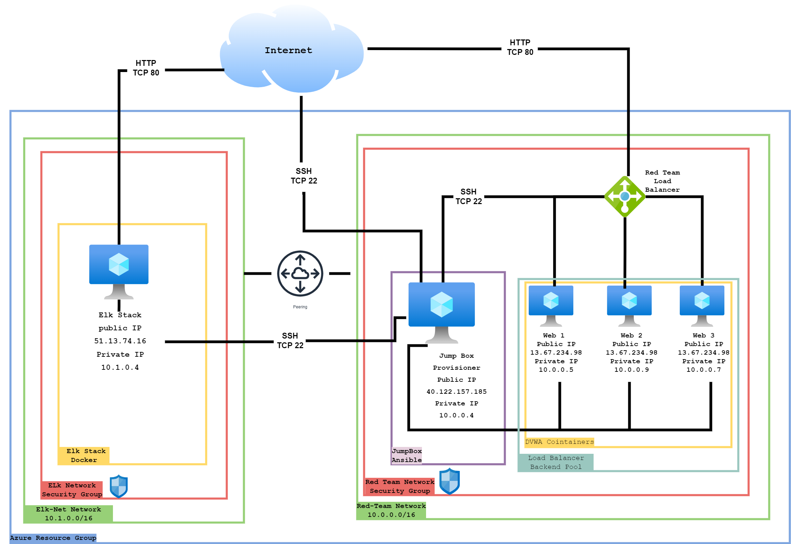

## Automated ELK Stack Deployment

The files in this repository were used to configure the network depicted below.

These files have been tested and used to generate a live ELK deployment on Azure. They can be used to either recreate the entire deployment pictured above. Alternatively, select portions of the _ansible_ file may be used to install only certain pieces of it, such as Filebeat.

  
  
  
  

This document contains the following details:
- Description of the Topology
- Access Policies
- ELK Configuration
  - Beats in Use
  - Machines Being Monitored
- How to Use the Ansible Build

### Description of the Topology

The main purpose of this network is to expose a load-balanced and monitored instance of DVWA, the D*mn Vulnerable Web Application.

Load balancing ensures that the application will be highly avalible, in addition to restricting access to the network.

Integrating an ELK server allows users to easily monitor the vulnerable VMs for changes to the log files and system metrics.

The configuration details of each machine may be found below.
_Note: Use the [Markdown Table Generator](http://www.tablesgenerator.com/markdown_tables) to add/remove values from the table_.

| Name                 | Function                   | IP Address | Operating System |
|----------------------|----------------------------|------------|------------------|
| Jump-Box-Provisioner | Gateway                    | 10.0.0.1   | Ubuntu LTS 18.04 |
| Elk                  |   Application Server       | 10.1.0.4   | Ubuntu LTS 18.04 |
| Web-1                |   Application Server       | 10.0.0.5   | Ubuntu LTS 18.04 |
| Web 2                |   Application Server       | 10.0.0.9   | Ubuntu LTS 18.04 |
| Web-3                |   Application Server       | 10.0.0.7   | Ubuntu LTS 18.04 |

### Access Policies

The machines on the internal network are not exposed to the public Internet. 

Only the Jump Box Provisionar machine can accept connections from the Internet. Access to this machine is only allowed from the following IP addresses:
- Home IP Address

Machines within the network can only be accessed by Jump Box Provisionar.

A summary of the access policies in place can be found in the table below.

| Name     | Publicly Accessible | Allowed IP Addresses |
|----------|---------------------|----------------------|
| Jump Box | Yes                 | Home Ip Address      |
| Elk-Stack| Yes                 | Home Ip Address      |            
| Web-1    | No                  | 10.0.0.4             |
| Web-2    | No                  | 10.0.0.4             |
| Web-3    | No                  | 10.0.0.4             |

### Elk Configuration

Ansible was used to automate configuration of the ELK machine. No configuration was performed manually, which is advantageous because it allows a consistent configuration. The Elk stack can be created and configured very quickly.

The playbook implements the following tasks:

-Configure maximum mapped memory with 'sysctl' module

-Install 'docker.io' and 'python3-pip' packages with apt module

-Install docker 'python' package with pip

-Enable systemd docker service

-Run ELK docker container

The following screenshot displays the result of running `docker ps` after successfully configuring the ELK instance.

### Target Machines & Beats
This ELK server is configured to monitor the following machines:

- Web-2:10.0.0.5
- Web-2:10.0.0.9
- Web-3:10.0.0.7 

We have installed the following Beats on these machines:

- Filebeat

- Metricbeat

These Beats allow us to collect the following information from each machine:

-Filebeat parses and forwards system logs from the Web VMs to the ELK Stack in an easy to read format.

-Metricbeat reports system and service statistics about the Web VMs to the ELK stack VM.

### Using the Playbook
In order to use the playbook, you will need to have an Ansible control node already configured. Assuming you have such a control node provisioned: 

SSH into the control node and follow the steps below:
- Copy the 'elk-stack-playbook.yml' file to '/etc/ansible/roles/ directory inside the ansible container.
- Update the 'etc/ansible/hosts file to include the Elk stack VM Ip address.
- Run the playbook, and navigate to 'http://[your elk IP]:5601/app/kibana. to check that the installation worked as expected.

